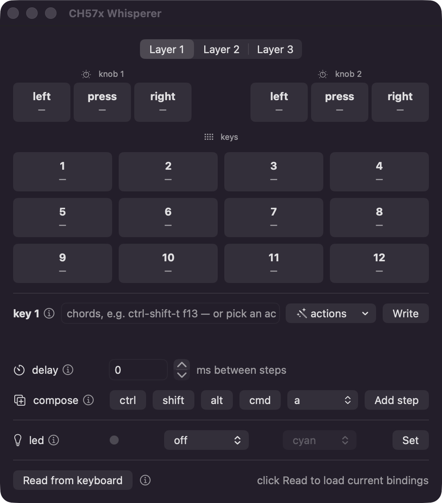

<p align="center"></p>

# CH57x Whisperer

A native macOS configurator for CH57x-based mini macro keyboards (12 keys + 2 clickable
knobs, 3 layers, USB `1189:8840`) — the cheap ones sold everywhere as "mini keyboard".

The vendor ships an x86_64 Windows/Qt app to configure them. This replaces it with a
small Swift tool that talks straight to the keyboard over IOKit HID: a CLI for scripting
and a SwiftUI GUI for humans. No drivers, no hidapi, no third-party dependencies.



## What it does

- **Bind keys and knobs** — up to 18 chords per key (e.g. `ctrl-shift-t`, `cmd-f13`),
  with an optional delay between steps, on any of the 3 layers
- **Media and mouse actions** — play/pause, volume, brightness, clicks, wheel, etc.
- **LED backlight** — per-layer mode (off, backlight, shock, press…) and color
- **Read back** the configuration stored in the keyboard
- **Record macros** by typing them on your real keyboard
- **GUI** — key grid, layer tabs, chord composer with searchable key picker (F13–F24
  included), all of the above without memorizing syntax

Bindings are written to the keyboard's own memory, so they persist and work on any
machine — you only need this tool to change them.

## Requirements

- macOS 13+ on Apple Silicon (Intel likely works, untested)
- The Swift toolchain — either Xcode or just the Command Line Tools:

  ```sh
  xcode-select --install
  ```

That's the complete dependency list. The package resolves zero external packages.

## Install

```sh
git clone https://github.com/palanx/ch57x-whisperer.git
cd ch57x-whisperer
swift build -c release
```

Run it in place with `swift run`, or put the binary on your PATH:

```sh
cp .build/release/ch57x-whisperer /usr/local/bin/
```

## Usage

**Connect the keyboard by USB cable or dongle.** Programming does not work over
Bluetooth — the keyboard pairs and types fine, but ignores configuration there.

```sh
ch57x-whisperer gui        # open the configurator
ch57x-whisperer probe      # check the keyboard is found (default command)
```

Or do everything from the CLI:

```sh
# bind key 3 on layer 1 to a chord sequence
ch57x-whisperer bind 1 3 cmd-space h o l a enter

# same, with 200 ms between each step
ch57x-whisperer bind 1 3 cmd-space h o l a enter --delay 200

# knobs: knob1/knob2 + ccw|press|cw
ch57x-whisperer bind 1 knob1-cw volumeup
ch57x-whisperer bind 1 knob1-press playpause

# mouse actions
ch57x-whisperer bind 2 5 ctrl-wheelup

# LED backlight per layer
ch57x-whisperer led 1 backlight-cyan
ch57x-whisperer led 2 off

# print what's stored in the keyboard
ch57x-whisperer read

# record a macro from your real keyboard (ESC to finish) and bind it to key 7
ch57x-whisperer record 1 7
```

Run `ch57x-whisperer` with no arguments (or any wrong ones) for the full syntax,
including every media/mouse token and LED mode.

### macOS permissions

- Talking to the keyboard needs **no permission** — the tool only opens the vendor
  config interface, never the actual keyboard input.
- `record` is the exception: it listens to your keystrokes, so macOS requires
  **Input Monitoring** (System Settings → Privacy & Security → Input Monitoring).
  Grant it to your terminal, then **fully restart the terminal** — the grant does not
  apply to running processes.

## Good to know

- **Layers** are switched with the physical slider on the keyboard; the LED color only
  shows the active layer's setting.
- **F13–F24 are the best macro keys** — they exist on no physical keyboard, so nothing
  conflicts. macOS apps see F13–F20 directly; F21–F24 arrive as HID events but need a
  `hidutil` remap to reach apps.
- A bad write can't brick the keyboard — worst case you re-bind one key.
- Media/mouse bindings hold a single action; only keyboard bindings can be sequences.

## Credits

The wire protocol was ported from two excellent reverse-engineering efforts:

- [kriomant/ch57x-keyboard-tool](https://github.com/kriomant/ch57x-keyboard-tool) — bind/LED protocol
- [kamaaina/macropad_tool](https://github.com/kamaaina/macropad_tool) — config read-back

This project just gives that protocol a native macOS home.
